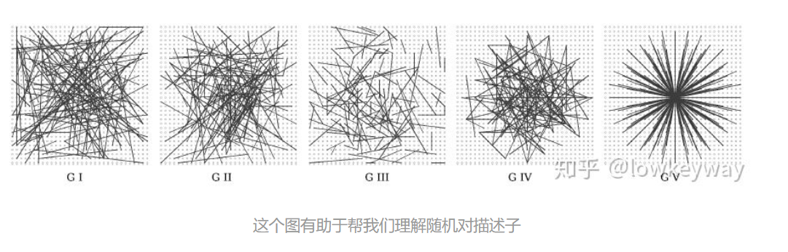

# 特征提取

主要囊括了HOG特征， SIFT特征， SURF特征， ORB特征， LBP特征， HAAR特征。

[参考网址机器视觉特征提取介绍：HOG、SIFT、SURF、ORB、LBP、**HAAR**](https://blog.csdn.net/yuanlulu/article/details/82148429)

### 1. HOG特征

【预处理】先灰度化，然后Gamma矫正，降低图像局部的阴影和光照变化造成的影响，抑制噪声的干扰。

HOG特征主要捕获 ==轮廓信息==， 统计每个cell的 ==梯度直方图==， 然后将若干个 cell 直方图组成一个 block 的descriptor。

要点：同一个block之间的cell之间的像素不重叠，但是不同block 之间的像素可能重叠。如下图： 

特征数量计算：9（梯度特征bin）* cell per block * ((height- block size)/ stride+1) *((width- block size)/ stride+1)

### 2. SIFT 特征

【实质】在不同尺度空间上查找关键点，并计算关键点的方向。 ==所得到的关键点特征：突出，光照鲁棒 ，仿射变换，噪音鲁棒==， 得到的点 一般是：角点，边缘点，暗区的亮点，亮区的暗点——梯度变化大。

【实现】 通过构建高斯金字塔，保证图像在任何尺度都有对应的特征点，保证尺度不变性。旋转不变形——则是通过梯度直方图实现。

【缺点】

- 实用性不高，需要不断地进行下采样和插值操作。
- 特征点较少
- 边缘光滑的目标无法准确提取特征

### 3. SURF特征

前面提到SITF的缺点是如果不借助硬件加速或专门的图像处理器很难达到实现，所以人们就要想办法对SITF算子进行改进，SURF算子便是对SIFT的改进，不过改进之后在算法的运行时间上还是没有质的飞跃。后面要介绍的ORB特征描述算子在运行时间上才是一种质的飞跃。

SURF最终生成的特征点的特征向量维度为64维。

### 4. [ORB特征](https://zhuanlan.zhihu.com/p/91479558)

ORB特征描述算法的运行时间远优于SIFT与SURF，可用于实时性特征检测。ORB特征基于FAST角点的特征点检测与描述技术，具有尺度与旋转不变性，同时对噪声及透视仿射也具有不变性
ORB特征检测主要分为以下两个步骤：

- 方向FAST特征点检测： FAST角点检测是一种基于机器学习的快速角点特征检测算法;
- BRIEF特征描述： BRIEF描述子主要是通过随机选取兴趣点周围区域的若干点来组成小兴趣区域，将这些小兴趣区域的灰度二值化并解析成二进制码串，将串特征作为该特征点的描述子，BRIEF描述子选取关键点附近的区域并对每一位比较其强度大小，然后根据图像块中两个二进制点来判断当前关键点编码是0还是1.因为BRIEF描述子的所有编码都是二进制数的，这样就节省了计算机存储空间。

- FAST方法

  确定候选角点（segment test)

  

  【步骤1】

  - 选择某个像素 ![[公式]](https://www.zhihu.com/equation?tex=p) ， 其像素值为 ![[公式]](https://www.zhihu.com/equation?tex=I_p) 。以 ![[公式]](https://www.zhihu.com/equation?tex=p) 为圆心，半径为3， 确立一个圆，圆上有16个像素，分别为 ![[公式]](https://www.zhihu.com/equation?tex=p_%7B1%7D%2C+p_%7B2%7D%2C+%5Cdots%2C+p_%7B16%7D)
  - 确定一个阈值： ![[公式]](https://www.zhihu.com/equation?tex=t) (比如 Ip 的 20%)。
  - 让圆上的像素的像素值分别与 ![[公式]](https://www.zhihu.com/equation?tex=p) 的像素值做差，如果存在连续n个点满足 ![[公式]](https://www.zhihu.com/equation?tex=I_x+-Ip%3Et) 或 ![[公式]](https://www.zhihu.com/equation?tex=I_x+-Ip%3C-t) （其中 ![[公式]](https://www.zhihu.com/equation?tex=I_x) 代表此圆上16个像素中的一个点），那么就把该点作为一个候选点。根据经验，一般令n=12(n 通常取 12，即为 FAST-12。其它常用的 N 取值为 9 和 11， 他们分别被称为 FAST-9，FAST-11).

  【步骤2】——非极大值抑制

  经过Step 1的海选后，还是会有很多个特征点。好在他们有个缺点：**很可能大部分检测出来的点彼此之间相邻**，我们要去除一部分这样的点。为了解决这一问题，可以采用非最大值抑制的算法：

  - 假设P，Q两个点相邻，分别计算两个点与其周围的16个像素点之间的差分和为V。
  - 去除V值较小的点，即把非最大的角点抑制掉。

  

  ==Oriented FAST==:

  - 尺度不变性：可以用金字塔解决；
  - 旋转不变性：可以用质心标定方向解决；

  **旋转不变性：**

  1、在一个小的图像块 B 中，定义图像块的矩。

  ![[公式]](https://www.zhihu.com/equation?tex=m_%7Bp+q%7D%3D%5Csum_%7Bx%2C+y%7D+x%5E%7Bp%7D+y%5E%7Bq%7D+I%28x%2C+y%29)

  2、通过矩可以找到图像块的质心

  ![[公式]](https://www.zhihu.com/equation?tex=C%3D%5Cleft%28%5Cfrac%7Bm_%7B10%7D%7D%7Bm_%7B00%7D%7D%2C+%5Cfrac%7Bm_%7B01%7D%7D%7Bm_%7B00%7D%7D%5Cright%29)

  3、连接图像块的几何中心 O 与质心 C，得到一个方向向量 ![[公式]](https://www.zhihu.com/equation?tex=%5Coverrightarrow%7BO+C%7D) ，这就是特征点的方向

  ![[公式]](https://www.zhihu.com/equation?tex=%5Ctheta%3D%5Coperatorname%7Batan%7D+2%5Cleft%28m_%7B01%7D%2C+m_%7B10%7D%5Cright%29)

  

  

- ==BRIEF特征==

  RIEF是2010年的一篇名为《[BRIEF:Binary Robust Independent Elementary Features](https://link.zhihu.com/?target=http%3A//cvlabwww.epfl.ch/~lepetit/papers/calonder_eccv10.pdf)》的文章中提出，**BRIEF是对已检测到的特征点进行描述，它是一种二进制编码的描述子**，摈弃了利用区域灰度直方图描述特征点的传统方法，**采用二级制、位异或运算**，大大的加快了特征描述符建立的速度，同时也极大的降低了特征匹配的时间，是一种非常快速，很有潜力的算法。

  ==BRIEF特征主要是解决 描述子空间冗余的问题==

  

  **特征点怎么来？**

  好了，我们知道了BRIEF的实质就是特征点的描述子。那么前提就是描述对象特征点从何而来？实际上，Harris/FAST/SIFT/SURF等算法提供的特征点都可以。

  

  **描述子怎么加？**

  1、为减少噪声干扰，先对图像进行高斯滤波（方差为2，高斯窗口为9x9）

  2、以特征点为中心，取SxS的邻域窗口。在窗口内随机选取一对（两个）点，比较二者像素的大小，进行如下二进制赋值。

  ![[公式]](https://www.zhihu.com/equation?tex=%5Ctau%28%5Cmathbf%7Bp%7D+%3B+%5Cmathbf%7Bx%7D%2C+%5Cmathbf%7By%7D%29%3A%3D%5Cleft%5C%7B%5Cbegin%7Barray%7D%7Bll%7D%7B1%7D+%26+%7B%3A+%5Cmathbf%7Bp%7D%28%5Cmathbf%7Bx%7D%29%3C%5Cmathbf%7Bp%7D%28%5Cmathbf%7By%7D%29%7D+%5C%5C+%7B0%7D+%26+%7B%3A+%5Cmathbf%7Bp%7D%28%5Cmathbf%7Bx%7D%29+%5Cgeq+%5Cmathbf%7Bp%7D%28%5Cmathbf%7By%7D%29%7D%5Cend%7Barray%7D%5Cright.)

  其中，p(x)，p(y)分别是随机点x=(u1,v1),y=(u2,v2)的像素值。

  3、在窗口中随机选取N对随机点，重复步骤2的二进制赋值，形成一个二进制编码，这个编码就是对特征点的描述，即特征描述子。（一般N=256）

  这个特征可以由n位二进制测试向量表示，**BRIEF描述子**：

  ![[公式]](https://www.zhihu.com/equation?tex=f_%7Bn%7D%28%5Cmathbf%7Bp%7D%29%3A%3D%5Csum_%7B1+%5Cleq+i+%5Cleq+n%7D+2%5E%7Bi-1%7D+%5Ctau%5Cleft%28%5Cmathbf%7Bp%7D+%3B+%5Cmathbf%7Bx%7D_%7Bi%7D%2C+%5Cmathbf%7By%7D_%7Bi%7D%5Cright%29)

  

  

  ## Rotated BRIEF

  在介绍ORB的改善之前，我们先思考一个问题。描述子是用来描述一个特征点的属性的，除了标记特征点之外，它最重要的一个功能就是要实现特征点匹配。BRIEF是如何实现特征点匹配的呢？

  答案是：Hamming距离！

  > 汉明距离是使用在数据传输差错控制编码里面的，汉明距离是一个概念，它表示两个（相同长度）字对应位不同的数量，我们以d（x,y）表示两个字x,y之间的汉明距离。对两个字符串进行异或运算，并统计结果为1的个数，那么这个数就是汉明距离。

  1. 两个特征编码对应bit位上相同元素的个数小于128的，一定不是配对的。
  2. 一幅图上特征点与另一幅图上特征编码对应bit位上相同元素的个数最多的特征点配成一对。

  其实就是**按位求异或**的过程。（相同为0，不同为1）

  

  所以，对于BRIEF来说，描述子里不包含旋转属性，所以一旦匹配图片有稍微大点的旋转角度，按照Hamming算法，匹配度将会大幅下降。

  

  **ORB如何优化？**

  **首先，做一些前期优化：**

  1. ORB算法进一步增强描述子的抗噪能力，采用积分图像来进行平滑；
  2. 在特征点的31x31邻域内，产生随机点对，并以随机点为中心，取5x5的子窗口。
  3. 比较两个随机点的子窗口内25个像素的大小进行编码（而不仅仅是两个随机点了）

  **其次，为BRIEF增加旋转不变性（Steered BRIEF）：**

  ORB算法采用关键点的主方向来旋转BEIEF描述子。

  1、对于任意特征点，在31x31邻域内位置为 ![[公式]](https://www.zhihu.com/equation?tex=%5Cleft%28x_%7Bi%7D%2C+y_%7Bi%7D%5Cright%29) 的n对点集，可以用2 x n的矩阵来表示：

  ![[公式]](https://www.zhihu.com/equation?tex=S%3D%5Cleft%28%5Cbegin%7Barray%7D%7Bl%7D%7Bx_%7B1%7D%2C+%5Ccdots%2C+x_%7Bn%7D%7D+%5C%5C+%7By_%7B1%7D%2C+%5Ccdots%2C+y_%7Bn%7D%7D%5Cend%7Barray%7D%5Cright%29)

  2、利用FAST求出的特征点的主方向 ![[公式]](https://www.zhihu.com/equation?tex=%5Ctheta) 和对应的旋转矩阵 ![[公式]](https://www.zhihu.com/equation?tex=R_%7B%5Ctheta%7D) ，算出旋转的 ![[公式]](https://www.zhihu.com/equation?tex=S_%7B%5Ctheta%7D) 来代表 ![[公式]](https://www.zhihu.com/equation?tex=S) ：

  ![[公式]](https://www.zhihu.com/equation?tex=%5Ctheta%3D%5Coperatorname%7Batan%7D+2%5Cleft%28m_%7B01%7D%2C+m_%7B10%7D%5Cright%29)

  ![[公式]](https://www.zhihu.com/equation?tex=R_%7B%5Ctheta%7D%3D%5Cleft%5B%5Cbegin%7Barray%7D%7Bcc%7D%7B%5Ccos+%5Ctheta%7D+%26+%7B-%5Csin+%5Ctheta%7D+%5C%5C+%7B%5Csin+%5Ctheta%7D+%26+%7B%5Ccos+%5Ctheta%7D%5Cend%7Barray%7D%5Cright%5D)

  ![[公式]](https://www.zhihu.com/equation?tex=S_%7B%5Ctheta%7D%3DR_%7B%5Ctheta%7D+S)

  3、计算旋转描述子（**steered BRIEF**）：

  ![[公式]](https://www.zhihu.com/equation?tex=g_%7Bn%7D%28p%2C+%5Ctheta%29%3A%3Df_%7Bn%7D%28p%29+%7C%5Cleft%28x_%7Bi%7D%2C+y_%7Bi%7D%5Cright%29+%5Cin+S_%7B%5Ctheta%7D)

  > 其中 ![[公式]](https://www.zhihu.com/equation?tex=f_%7Bn%7D%28%5Cmathbf%7Bp%7D%29%3A%3D%5Csum_%7B1+%5Cleq+i+%5Cleq+n%7D+2%5E%7Bi-1%7D+%5Ctau%5Cleft%28%5Cmathbf%7Bp%7D+%3B+%5Cmathbf%7Bx%7D_%7Bi%7D%2C+%5Cmathbf%7By%7D_%7Bi%7D%5Cright%29) 为BRIEF的描述子。

  

  **最后，rBRIEF-改进特征点描述子的相关性**

  使用steeredBRIEF方法得到的特征描述子具有旋转不变性，但是却在另外一个性质上不如原始的BRIEF算法。是什么性质呢，是描述符的可区分性，或者说是相关性。这个性质对特征匹配的好坏影响非常大。描述子是特征点性质的描述。描述子表达了特征点不同于其他特征点的区别。我们计算的描述子要尽量的表达特征点的独特性。如果不同特征点的描述子的可区分性比较差，匹配时不容易找到对应的匹配点，引起误匹配。ORB论文中，作者用不同的方法对100k个特征点计算二进制描述符，对这些描述符进行统计，如下表所示：

  特征描述子的均值分布。X轴代表距离均值0.5的距离；y轴是相应均值下的特征点数量统计

#### 5. LBP特征

1. ==经典LBP==

   经典LBP的算子窗口为3×3的正方形窗口，以窗口中心像素为阈值，将其相邻8领域像素灰度与中心像素值比较，若中心像素值小于周围像素值，则该中心像素位置被标记为1，否则为0（显然这种规则下，对于中心点大于或等于这两种情况，算法无法区分，后续经过改进引入LBP+与LBP-因子用来区分这两种情况）。图像经过这种遍历操作后，图像就被二值化了，每一个窗口中心的8邻域点都可以由8位二进制数来表示，即可产生256种LBP码，这个LBP码值可以用来反映窗口的区域纹理信息。LBP具体在生成的过程中，先将愿意图像划分为若干个子区域，子区域窗口可根据原图像的尺寸进行调整，而不一定非得为3×3的正方形窗口。一般对于512×640的图像，子区域窗口区域选取大小为16×16.

2. ==圆形LBP==

   经典LBP用正方形8-领域来描述图像的纹理特征，其缺点是难以满足不同尺寸和频率的需求。Ojala等人对经典LBP进行了改进，提出了将3×3的正方形窗口领域扩展到任意圆形领域。由于圆形LBP采样点在圆形边界上，那么必然会导致部分计算出来的采样点坐标不是整数，因此这里就需要对得到的坐标像素点值进行处理，常用的处理方法是最近邻插值或双线性插值。

### 6.HAAR特征

人脸检测最为经典的算法Haar-like特征+Adaboost。这是最为常用的物体检测的方法（最初用于人脸检测），也是用的最多的方法。

- 训练过程： 输入图像->图像预处理->提取特征->训练分类器（二分类）->得到训练好的模型；

- 测试过程：输入图像->图像预处理->提取特征->导入模型->二分类（是不是所要检测的物体）。

Haar-like特征是很简单的，无非就是那么几种，如两矩形特征、三矩形特征、对角特征。后来，还加入了边缘特征、线特征、中心环绕特征等。使用积分图可以加速计算特征。最后，使用集成的方法Adaboost进行训练。

