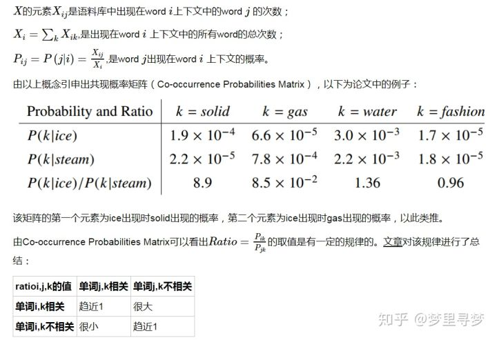
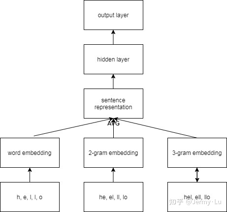
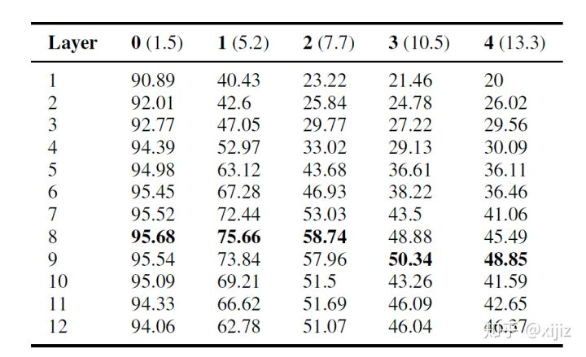

### 针对不同的主旨句：
 	1. 观点要明确
 	2. 反驳要引用、客观
 	3. 具体的人和地、谚语，不能使用代词（实词的重要性）

#### FPE： 采用传统的机器学习算法——LR， XGboost和LightGBM， 其中的很多特征工程可以使用

​	==Log Loss = 0.672==
​	使用了哪些特征呢？？

1. 统计缩写的次数（won\'t， can't, 's等）， 然后进行展开

2. 词性数量的统计 **# 其实没有多大的作用**

3. 统计词性还原的数量

4. 获取 discourse_text 列的 以上特征

   | essay_id | essay_text   | essay_text_num_words                              | essay_text_num_unique_words | essay_text_num_chars | essay_text_num_stopwords | essay_text_num_punctuations | essay_text_num_words_upper | essay_text_num_words_title | essay_text_mean_word_len | essay_text_num_paragraphs | essay_text_num_contractions | essay_text_polarity | essay_text_subjectivity | essay_text_nn_count | essay_text_pr_count | essay_text_vb_count | essay_text_jj_count | essay_text_uh_count | essay_text_cd_count |      |
   | :------- | :----------- | :------------------------------------------------ | :-------------------------- | :------------------- | :----------------------- | :-------------------------- | :------------------------- | :------------------------- | :----------------------- | :------------------------ | :-------------------------- | :------------------ | :---------------------- | :------------------ | :------------------ | :------------------ | :------------------ | :------------------ | :------------------ | ---- |
   | 0        | D72CB1C11673 | Making choices in life can be very difficult. ... | 421                         | 186                  | 2416                     | 198                         | 39                         | 0                          | 31                       | 4.729216                  | 9                           | 1                   | 0.162225                | 0.469976            | 95                  | 38                  | 86                  | 49                  | 0                   | 2    |

5. 同时获取 essay全文的 以上特征

   

6. 进行Glove Embeddings

   这是什么呢？

   ==可能损失了领域内的 相关特性==

   > GloVe：Global Vectors。
   >
   > 模型输入：语料库 corpus
   >
   > 模型输出：每个词的表示向量

   ## **基本思想**

   要讲GloVe模型的思想方法，我们先介绍两个其他方法：

   一个是基于奇异值分解（SVD）的[LSA](https://link.zhihu.com/?target=https%3A//en.wikipedia.org/wiki/Latent_semantic_analysis)算法，该方法对term-document矩阵（矩阵的每个元素为tf-idf）进行奇异值分解，从而得到term的向量表示和document的向量表示。此处使用的tf-idf主要还是term的全局统计特征。

   另一个方法是[word2vec](https://link.zhihu.com/?target=https%3A//www.cnblogs.com/Weirping/p/(http%3A//blog.csdn.net/itplus/article/details/37969519))算法，该算法可以分为skip-gram 和 continuous bag-of-words（CBOW）两类,但都是基于局部滑动窗口计算的。即，该方法利用了局部的上下文特征（local context）

   LSA和word2vec作为两大类方法的代表，一个是利用了全局特征的矩阵分解方法，一个是利用局部上下文的方法。

   GloVe模型就是将这两中特征合并到一起的，即使用了语料库的全局统计（overall statistics）特征，也使用了局部的上下文特征（即滑动窗口）。为了做到这一点GloVe模型引入了Co-occurrence Probabilities Matrix。

   首先引入word-word的共现矩阵XX，

   

   

7. 最终得到 df数据 形状为 （操作对象为 discourse_text, 全文）

   ```python 
   glove_vec_df: (36765, 300)
   discourse_train: (36765, 319)
   
   glove_vec_df: (4191, 300)
   essay_train: (4191, 319)
   ```

8. FastText Embeddings (==在glove_vec上操作==)

   这是什么嵌入方式呢？优点是什么？

   

   ```python
   fasttext_vec_df: (36765, 300)
   discourse_train: (36765, 618)
   
   fasttext_vec_df: (4191, 300)
   essay_train: (4191, 618)
   ```

9. merge_all_datasets

   ```python
   train = pd.merge(
       train,
       discourse_train,
       how='inner',
       on='discourse_id',
       sort=False
   )
   
   train = pd.merge(
       train,
       essay_train,
       how='inner',
       on='essay_id',
       sort=False
   )
   
   print(f"train: {train.shape}")
   train.head()
   train: (36765, 1241)
   ```

10. 其他特征

    其中单词ration, unique_words_ration都很用呀

    ```python
    train['discourse_index'] = train.apply(lambda x: x['essay_text'].find(x['discourse_text']), axis=1)
    train['num_words_ratio'] = train['discourse_text_num_words']/train['essay_text_num_words']
    train['num_unique_words_ratio'] = train['discourse_text_num_unique_words']/train['essay_text_num_unique_words']
    
    # 关于char的作用可能并不大
    train['num_chars_ratio'] = train['discourse_text_num_chars']/train['essay_text_num_chars']
    train['num_stopwords_ratio'] = train['discourse_text_num_stopwords']/train['essay_text_num_stopwords']
    
    # 标点符号的影响 比如“？”
    train['num_punctuations_ratio'] = train['discourse_text_num_punctuations']/train['essay_text_num_punctuations']
    train['mean_word_len_ratio'] = train['discourse_text_mean_word_len']/train['essay_text_mean_word_len']
    train.head()
    # 5 rows × 1248 columns
    ```

### DeBerta-v3-large: 

​	1.问题——只是采用当前句，效果并不是多好 
​	

```python
df['inputs'] = df.discourse_type + sep +df.discourse_text
```

​	==Log Loss = 0.722==
​	
​		2.采用当前 句 和 全文， 效果提高明显

```python

training_samples = []
for _, row in tqdm(df.iterrows(), total=len(df)):
    idx = row["essay_id"]
    discourse_text = row["discourse_text"]
    discourse_type = row["discourse_type"]

    if is_train:
        filename = os.path.join(args.input, "train", idx + ".txt")
    else:
        filename = os.path.join(args.input, "test", idx + ".txt")

    with open(filename, "r") as f:
        text = f.read()

    encoded_text = tokenizer.encode_plus(
        discourse_type + " " + discourse_text,
        text,
        add_special_tokens=False,
    )
    input_ids = encoded_text["input_ids"]

    sample = {
        "discourse_id": row["discourse_id"],
        "input_ids": input_ids,
        # "discourse_text": discourse_text,
        # "essay_text": text,
        # "mask": encoded_text["attention_mask"],
    }

    if "token_type_ids" in encoded_text:
        sample["token_type_ids"] = encoded_text["token_type_ids"]

    label = row["discourse_effectiveness"]

    sample["label"] = LABEL_MAPPING[label]

    training_samples.append(sample)

```


​	==Log Loss = 0.627==

所以： 特征工程可以借鉴一下

DeBertav3该如何使用  特征工程呢？ 怎么嵌入


**思考：**

1. fast text只是 发掘了全文的信心， 所以如果使用debertav3, 是没什么用的， 可以 ==舍弃==
2. 可以借用词性（代词）的ratio ， 缩写的使用等
3. 详细的弄清 Glove vec的作用
4. 统计方向：从评率角度和相关性出发， 但是 DeBerta v3直接从相关性出发


理解BERT


1. 如图2-4所示，该表是主谓一致得分表，第二列到第六列是在主语和动词插入的名词数量，括号里面的数字是主语到谓语动词的平均距离。结果表明在大多数情况下，中间层网络表现得更好，这也印证了上一部分句法特征主要在BERT中间层进行编码的假设。

   有趣的是，随着插入名词的增多，BERT更高层的网络也逐渐能够处理长程依赖问题，效果要比低层网络更好，这证明BERT只有有更深的层数才能在大多数自然语言处理（NLP）上更有竞争力。

   BERT中间层能学到比较好的语义特征