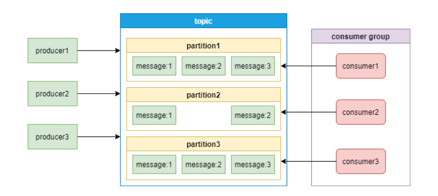
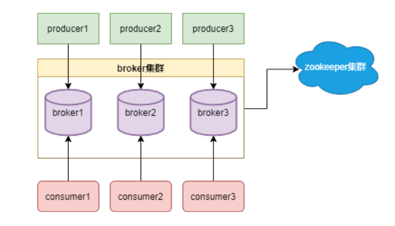

# Kafka

## **[一篇就够了](https://www.cnblogs.com/cxuanBlog/p/11949238.html)**

用途：用户行为分析、日志存储、异步通信

特点：

- 时间复杂度O(1) 提供消息持久化能力，对大数据量保证常数时间的访问性
- 高吞吐量
- 支持服务器间的消息分区
- 轻量级，支持实时数据处理和离线数据处理

主要功能：

- 发布和订阅消息流，类似于==消息队列==
- 容错的方式记录消息流，==分布式存储系统==，使用多副本实现故障转移，作为数据存储系统使用
- 消息发布的时候进行处理，==实时处理==

==**重点**==：什么是分区（partition)??
分区是物理上的分组，一个topic可以有多个分区，每个分区中的消息会被分配到一个有序的id作为offset，每个consumer group只能有一个消费者消费一个分区

为什么进行分区：topic中的消息只存于一个broker，会成为瓶颈；所以为 解决 ==水平扩展问题==  甚至是 ==负载均衡问题==

Zookeeper和Kafka的关系

从图中可知：zookeeper主要是管理， 或者说是组成了 kafka的broker集群。

由于broker分布部署，需要注册中心进行统一管理，Zookeeper用专门的节点保存Broker服务列表。

broker在向Zookeeper进行注册后，生产者根据 broker节点感知broker集群的变化， 实现动态负载均衡

Kafka 全程解析：

1. 发布消息：Producer采用Push模式将消息发布到Kafka Broker中，根据负载均衡算法（轮询、Hash)，这些消息将均衡写入到相应Topic 的各个Partition中。在物理存储层面，采用顺序写磁盘（append）。

   - Producer Push消息，基于负载均衡算法，获取目标Partition， Producer从Zookeeper中 /brokers/.../state节点找到该 Partition的 Leader
   - Producer 将消息发送给该Leader
   - Leader将消息写入本地Log
   - 所有的Follower主动从 Leader Pull消息，写入本地Log后向Leader发送ACK
   - Leader收到所有的ISR 中所有 Replica的ACK后，更新HW，最后Commit ，向Producer发送Ack
   - Producer收到Ack后，确认发送成功

2. Broker存储消息

   Topic是逻辑概念，Partition是物理概念。每个Partition在存储层面对应一个文件夹。由于Partition并不是最终的存储粒度，该问价夹下有多个 Segment

3. Consumer消费信息

   Consumer消费信息时，需要指定Topic，API内部实现负载均衡，将Offset记录到ZooKeeper上

提交和偏移量概念

偏移：记录user group对 partition中数据消费到的位置

==**Kafka面试问题**==

1. Kafka幂等性：保证producer的消息，有且仅被执行一次

   kafka在0.11版新增了幂等型producer和事务型producer。前者解决了单会话幂等性等问题，后者解决了多会话幂等性

2. 单会话幂等性

   为解决producer重试引起的乱序和重复。Kafka增加了pid和seq。Producer中每个RecordBatch都有一个单调递增的seq; Broker上每个tp也会维护pid-seq的映射，并且每Commit都会更新lastSeq。这样recordBatch到来时，broker会先检查RecordBatch再保存数据：如果batch中 baseSeq(第一条消息的seq)比Broker维护的序号(lastSeq)大1，则保存数据，否则不保存(inSequence方法)。

3. 多会话幂等性

   在单会话幂等性中介绍，kafka通过引入pid和seq来实现单会话幂等性，但正是引入了pid，当应用重启时，新的producer并没有old producer的状态数据。可能重复保存。

   ==Kafka事务通过隔离机制来实现多会话幂等性==

   kafka事务引入了transactionId 和Epoch，设置transactional.id后，一个transactionId只对应一个pid, 且Server 端会记录最新的 Epoch 值。这样有新的producer初始化时，会向TransactionCoordinator发送InitPIDRequest请求， TransactionCoordinator 已经有了这个 transactionId对应的 meta，会返回之前分配的 PID，并把 Epoch 自增 1 返回，这样当old producer恢复过来请求操作时，将被认为是无效producer抛出异常。 如果没有开启事务，TransactionCoordinator会为新的producer返回new pid，这样就起不到隔离效果，因此无法实现多会话幂等。