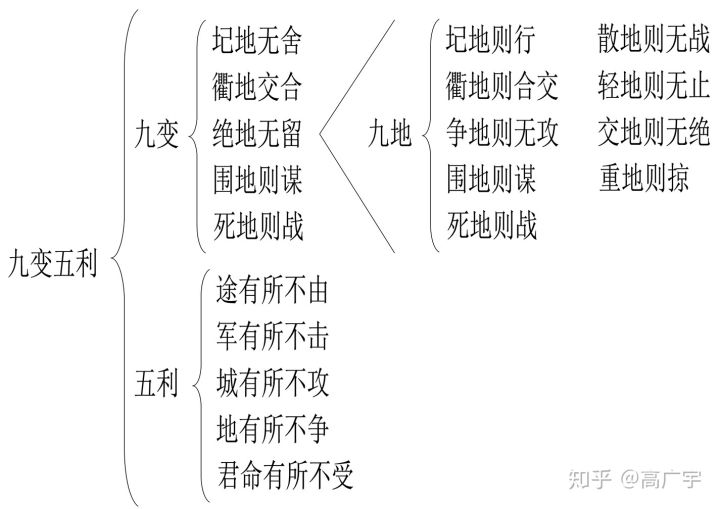

# 孙子兵法

### 九变篇

【原文】

《九变》篇是《孙子兵法》的第八篇，主要论述了九变五利。知九变五利才能用好军队，战场要懂得随机应变，做到有备无患。分为4章， 第一章为九变五利是什么？第二章讲将领需要知九变五利才能用好军队。第三章讲要兼顾利害，才能消除隐患而达到目的。第四章讲将有五危，五危会导致失败。

1. 什么是九变五利？

   【原文】孙子曰：凡用兵之法，将受命于君，合军聚众。圮地无舍，衢地交合，绝地无留，围地则谋，死地则战。涂有所不由，军有所不击，城有所不攻，地有所不争，君命有所不受。

   【译文】孙子说：用兵的原则，将接受国君的命令，召集人马组建军队， 在难于通行之地不要驻扎，在四通八达的交通要道要与四邻结交，在难以生存的地区不要停留，在四周有险阻容易被包围的地区要精于谋划，误入死地则须坚决作战。有的道路不要走，有些敌军不要攻，有些城池不要占，有些地域不要争，君主的某些命令也可以不接受。

   【详解】本章阐述影响胜利的主要是我方的实力和战术，敌人的实力和战术，以及地形环境对于敌我双方的影响。九地五变主要是地形环境对于敌我的影响。

   

   

   九地和五利：“圮地无舍，衢地交合，绝地无留，围地则谋，死地则战。涂有所不由，军有所不击，城有所不攻，地有所不争，君命有所不受。”是十句话，而不是九句或者十四句。有人认为前九句为九变，但是五利就没法解释了。有人认为九变应该是五变，即前五句是五变，后五句是五利。有人认为九变只是指的多变，九并不是确定的数。

   **九变**： 介绍了九种军事地理，这些不是单纯的地形，而是敌我所处位置。九地包括：散地、轻地、争地、交地、衢地、重地、圮地、围地和死地。本章主要包括了圮地、衢地、围地和死地。

   

   **五利**：涂有所不留、军有所不击、城有所不攻、地有所不争、君命有所不受。表示需要变通，要有所不为。如何判断有所谓和有所不为？ ==以全局利益为衡量标准，放弃局部利益，做到有所不为。==

   

2. 将领要知道九变五利，才能用好军队。

   【原文】故将通于九变之利者，知用兵矣；将不通于九变之利者，虽知地形，不能得地之利者矣。治兵不知九变之术，虽知五利，不能得人之用矣。

   【译文】所以将帅精通“九变”的具体运用，就是真懂得用兵了；将帅不精通“九变”的具体运用，就算熟悉地形，也不能得到地利。指挥作战如果不懂“九变”的方法，即使知道“五利”，也不能充分发挥部队的战斗力。

   【详解】本章主要讲将领知九变五利，才能用好军队。将帅知道九变，才懂得用兵，不知九变，虽知地形，但也得不到地利。作战不知九变，虽知五利，但也不能发挥军队的作用。

   

   

   古代的战斗都是陆战，敌我军队必须利用陆上地形展开战斗，《九地》给出了九种军事地理，还给出了对应的策略，策略错误就得不到地利，不能发挥好军队的实力。

   

   **什么是衢地？**：“诸侯之地三属，先至而得天下之众者，为衢地。”

   其为敌我和其他诸侯国接壤的地区，先到就可以结交诸侯国并取得他们的支援。衢地的策略是交合，通过结交衢地的诸侯，增加自己一方的力，进而增加胜利的可能性。如果将领不知道九变之利，既是知道衢地四通八达的地形，也得不到衢地的利益，因为他不知道对应的交合策略。

   

3. 第三章为兼顾利与害，才能消除隐患而达到目的。

   【原文】是故智者之虑，必杂于利害。杂于利，而务可信也；杂于害，而患可解也。是故屈诸侯者以害，役诸侯者以业，趋诸侯者以利。故用兵之法，无恃其不来，恃吾有以待也；无恃其不攻，恃吾有所不可攻也。

   【译文】智慧明达的将帅考虑问题，必然把利与害一起权衡。在考虑不利条件时，同时考虑有利条件，大事就能顺利进行；在看到有利因素时同时考虑到不利因素，祸患就可以排除。因此，用计谋去伤害它，要使各国诸侯的力量不能伸展；用事情驱使它，要使各国诸侯忙于应付；用利益引诱他，使各国诸侯被动奔走。所以用兵的原则是：不要指望敌人不来打，而要依靠我方有充分准备等待它；不要指望敌人不进攻，而要依靠我方有了使敌人进攻不下的方法。

   【详解】这章主要讲兼顾利和害，才能消除隐患而达到目的。

   

   

4. 第四章为将有五危，五危会导致失败

   【原文】故将有五危：必死，可杀也；必生，可虏也；忿速，可侮也；廉洁，可辱也；爱民，可烦也。凡此五者，将之过也，用兵之灾也。覆军杀将，必以五危，不可不察也。

   【译文】所以将领有五种致命的弱点：只知死拼会被杀，贪生怕死会被俘，急躁易怒则经不起剌激，廉洁自爱则受不了侮辱，爱护居民则遭受烦劳。这五种危险，是将帅的过错，也是用兵的灾难。军队覆灭、将军被杀，都由于这五种危险引起，是不可不警惕的。

   【详解】第四章讲将有五危，五危会导致失败。五危包括必死、必生、忿速、廉洁和爱民。

   

   

   

引用网站：[https://zhuanlan.zhihu.com/p/43772205](https://zhuanlan.zhihu.com/p/43772205)