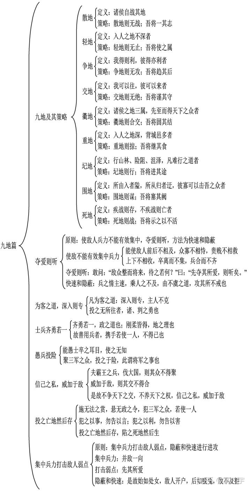
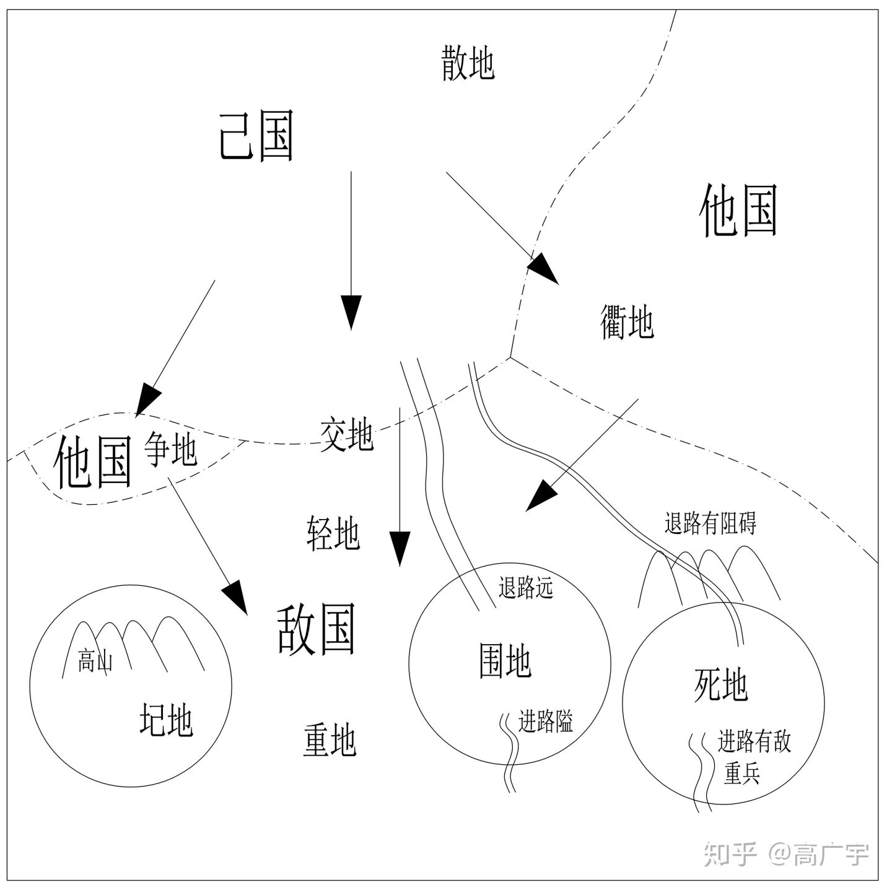
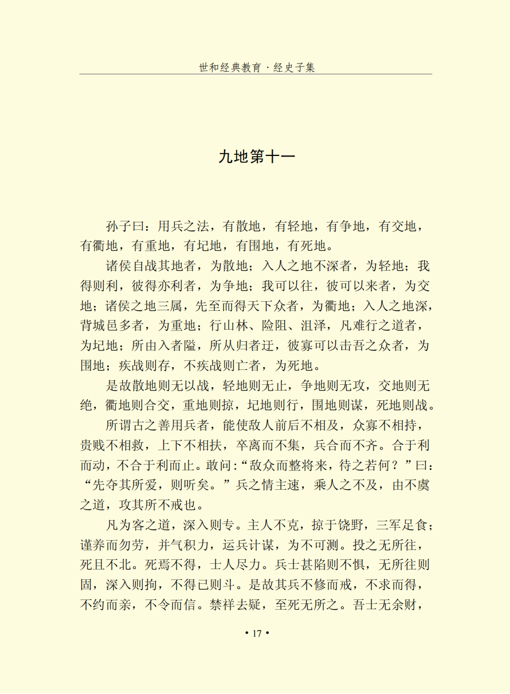
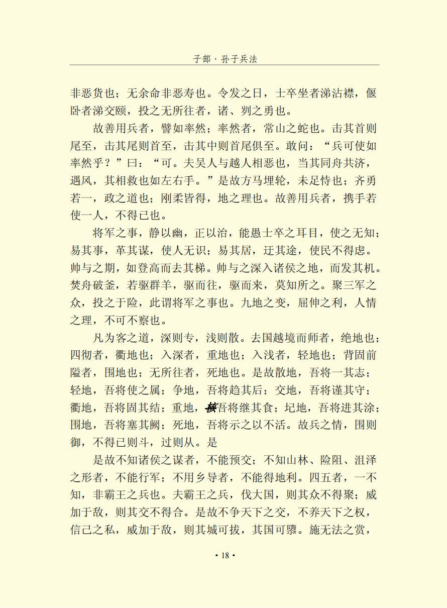
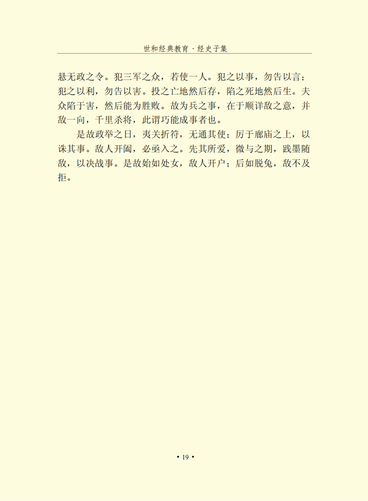

# 孙子兵法

### 九地第十一篇

主要论述了九地及其应对策略。全篇分为九章。第一章讲九地的定义和应对策略。第二章使敌人兵力不能有效集中，夺爱则听，方法为快速和隐蔽，即快速隐蔽的打击敌人的依仗点。第三章讲为客之道，深入则专。深入敌方国境，我方的士卒就会专心作战，因为别无他路。第四章讲士兵齐勇若一，是因为士兵不得不这样做。第五章讲将军御兵诀窍是愚兵投险，士兵深处险境，就能爆发更大的力量。第六章讲九地正面的应对策略。第七章讲不争天下之交，不养天下之权，信己之私，威加于敌。第八章讲投之亡地然后存，陷之死地然后生。第九章讲集中兵力打击敌人弱点，隐蔽和快速进行进攻。

【原文】

【通译】

孙子说：按照用兵的原则，军事地理有散地、轻地、争地、交地、衢地、重地、圮地、围地、死地。诸侯在本国境内作战的地区，叫做散地。在敌国浅近纵深作战的地区，叫做轻地。我方得到有利，敌人得到也有利的地区，叫做争地。我军可以前往，敌军也可以前来的地区，叫做交地。多国相毗邻，先到就可以获得诸侯列国援助的地区，叫做衢地。深入敌国腹地，背靠敌人众多城邑的地区，叫做重地。山林险阻沼泽等难于通行的地区，叫做圮地。行军的道路狭窄，退兵的道路迂远，敌人可以用少量兵力攻击我方众多兵力的地区，叫做围地。迅速奋战就能生存，不迅速奋战就会全军覆灭的地区，叫做死地。因此，处于散地就不宜作战，处于轻地就不宜停留，遇上争地就不要勉强强攻，遇上交地就不要断绝联络，进入衢地就应该结交诸侯，深入重地就要掠取粮草，碰到圮地就必须迅速通过，陷入围地就要设谋脱险，处于死地就要力战求生。

从前善于指挥作战的人，能使敌人前后部队不能相互策应，主力和小部队无法相互依靠，官兵之间不能相互救援，上下级之间不能互相联络，士兵分散不能集中，合兵布阵也不整齐。对我有利就打，对我无利就停止行动。试问：敌人兵员众多且又阵势严整向我发起进攻，那该用什么办法对付它呢？回答是：先夺取敌人最关心爱护的，这样就听从我们的摆布了。用兵之理贵在神速，要乘敌人措手不及的时机，走敌人意料不到的道路，攻击敌人没有戒备的地方。

在敌国境内进行作战的一般规律是：越深入敌国腹地，我军军心就越坚固，敌人就不易战胜我们。在敌国丰饶地区掠取粮草，部队给养就有了保障。要注意休整部队，不要使其过于疲劳，保持土气，养精蓄锐。部署兵力，巧设计谋，使敌人无法判断我军的意图。将部队置于无路可走的绝境，士卒就会宁死不退。士卒既能宁死不退，那么他们怎么会不殊死作战呢！士卒深陷危险的境地，就不再存在恐惧，一旦无路可走，军心就会牢固。深入敌境军队就不会离散。遇到迫不得已的情况，军队就会殊死奋战。因此，不须整饬就能注意戒备，不用强求就能完成任务，无须约束就能亲密团结，不待申令就会遵守纪律。禁止占卜迷信，消除士卒的疑虑，他们至死也不会逃避。我军士卒没有多余的钱财，并不是不爱钱财；士卒置生死于度外，也不是不想长寿。当作战命令颁布之时，坐着的士卒泪沾衣襟，躺着的士卒泪流满面，但把士卒置于无路可走的绝境，他们就都会象专诸、曹刿一样的勇敢。

善于指挥作战的人，能使部队自我策应如同“率然”蛇一样。“率然”是常山地方一种蛇，打它的头部，尾巴就来救应；打它的尾，头就来救应；打它的腰，头尾都来救应。试问：可以使军队象“率然”一样吧？回答是：可以。那吴国人和越国人是互相仇视的，但当他们同船渡河而遇上大风时，他们相互救援，就如同人的左右手一样。所以，想用缚住马缰、深埋车轮这种显示死战决心的办法来稳定部队，是靠不住的。要使部队能够齐心协力奋勇作战如同一人，关键在于部队管理教育有方。要使强弱不同的士卒都能发挥作用，在于恰当地利用地形。所以善于用兵的人，能使全军上下携手团结如同一人，这是因为客观形势迫使部队不得不这样。

主持军事行动，要做到考虑谋略沉着冷静而幽深莫测，管理部队公正严明而有条不紊。要能蒙蔽士卒的视听，使他们对于军事行动毫无所知；变更作战部署，改变原定计划，使人无法识破真相；不时变换驻地，故意迂回前进，使人无从推测意图。将帅向军队赋予作战任务，要象使其登高而抽去梯子一样。将帅率领士卒深入诸侯国土，要象弩机发出的箭一样一往无前。对待士卒要能如驱赶羊群一样，赶过去又赶过来，使他们不知道要到哪里去。集结全军，把他们置于险境，这就是统帅军队的要点。九种地形的应变处置，攻防进退的利害得失，全军上下的心理状态，这些都是作为将帅不能不认真研究和周密考察的。

在敌国境内作战的规律是：深入敌境则军心稳固，浅入敌境则军心容易涣散。进入敌境进行作战的称为绝地；四通八达的地区叫做衢地；进入敌境纵深的地区叫做重地；进入敌境浅的地区叫做轻地；背有险阻前有隘路的地区叫围地；无路可走的地区就是死地。因此，在散地，要统一军队意志；在轻地，要使营阵紧密相连；在争地，要迅速出兵抄到敌人的后面；在交地，就要谨慎防守；在衢地，就要巩固与列国的结盟；入重地，就要保障军粮供应；在圮地，就必须迅速通过；陷入围地，就要堵塞缺口；到了死地，就要显示死战的决心。所以，士卒的心理状态是：陷入包围就会竭力抵抗，形势逼十迫就会拚死战斗，身处绝境就会听从指挥。不了解诸侯列国的战略意图，就不要与之结交；不熟悉山林、险阻、沼泽等地形情况，就不能行军；不使用向导，就无法得到地利。这些情况，如有一样不了解，都不能成为称王争霸的军队。凡是王霸的军队，进攻大国，能使敌国的军民来不及动员集中；兵威加在敌人头上，能够使敌方的盟国无法配合策应。因此，没有必要去争着同天下诸侯结交，也用不着在各诸侯国里培植自己的势力，只要施展自己的战略意图，把兵威施加在敌人头上，就可以拔取敌人的城邑，摧毁敌人的国都。施行超越惯例的奖赏，颁布不拘常规的号令，指挥全军就如同使用一个人一样。向部下布置作战任务，但不说明其中意图。只告知利益而不指出危害。将士卒置于危地，才能转危为安；使士卒陷于死地，才能起死回生。军队深陷绝境，然后才能赢得胜利。所以，指导战争的关键，在于谨慎地观察敌人的战略意图，集中兵力攻击敌人一部，千里奔袭，斩杀敌将，这就是所谓巧妙用兵，实现克敌制胜的目的。

因此，在决定战争方略的时候，就要封锁关口，废除通行符证，不充许敌国使者往来；要在庙堂里再三谋划，作出战略决策。敌人一旦出现间隙，就要迅速乘机而入。首先夺取敌人战略要地，但不要轻易与敌约期决战。要灵活机动，因敌情来决定自己的作战行动。因此，战争开始之前要象处女那样显得沉静柔弱，诱使敌人放松戒备；战斗展开之后，则要象脱逃的野兔一样行动迅速，使敌人措手不及，无从抵抗。