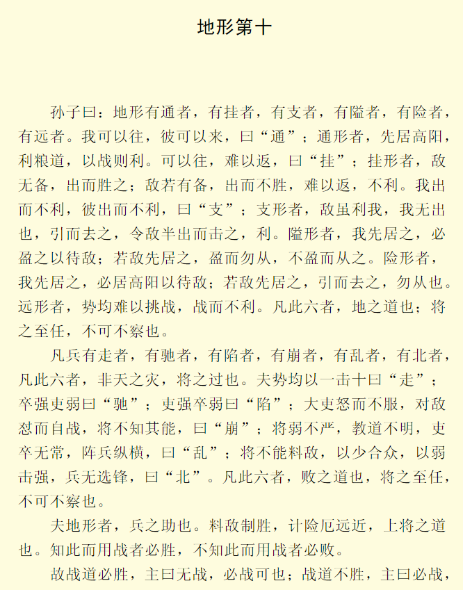
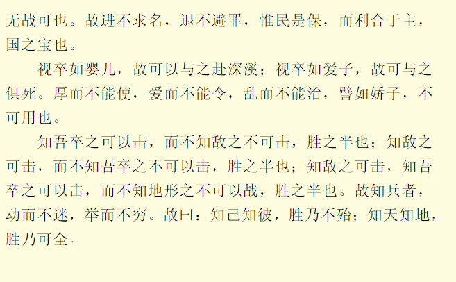

# 孙子兵法

### 地形篇

【原文】

【通译】

>   孙子说：地形有通、挂、支、隘、险、远等六类。我们可以去，敌人可以来的地域叫做通；在通形地域，应抢先占据地势高而向阳的地方，并保持粮道畅通，这样与敌交战就有利。可以前进，不易返回的地域叫做挂；在挂形地域，敌军如无防备，就要突然出击战胜它；如果敌有防备，我出击不能取胜，就难以返回，于我不利。凡是我出击不利，敌出击也不利的地方，叫做支；在支形地区，敌人虽然以利诱我，也不要出击；最好是带领部队假装离去，诱使敌军前出一半时，我突然发起攻击，这样有利。在隘形地，我若先敌占据，就要用重兵堵塞隘口，等待敌人来攻；如果敌军已先我占据隘口，并以重兵据守，那就不要进击，若敌人没有用重兵据守隘口，就迅速攻取它。在险形地区，如我先敌占领，要占据地势高而向阳的地方侍击敌人；如果敌人已先占领，那就主动撤退，不要进攻它。在远形地区，双方势均力敌，不宜挑战，勉强求战，于我不利。以上六点，是关于利用地形的原则；这是将帅的重要责任，是不可不认真考虑研究的。
>
> ​    军队失败的情况有走、弛、陷、崩、乱、北等六种。这六种情况，都不是由于[天灾](http://www.gushicimingju.com/tag/371.html)造成的，而是由于将帅的过失所致。在敌我条件相当的情况下，如果攻击十倍于我的敌人，因而失败的，叫做走。土卒强悍，将吏懦弱，因而失败的，叫做弛。将吏本领高强，士卒怯弱，因而失败的，叫做陷。部将怨怒而不服从指挥，遇到敌人忿然擅自出战，主将又不了解他的能力而加以控制，因而失败的，叫做崩。主将软弱而又缺乏威严，训练[教育](http://www.gushicimingju.com/tag/163.html)不明，吏卒无所遵循，布阵杂乱无章，因而失败的，叫做乱。主将不能正确判断敌情，以少击多，以弱击强，又没有精锐部队为骨干，因而失败的，叫做北。以上六种情况，必然导致军队的失败；这是将帅的重大责任，是不可不认真考虑研究的。
>
> 　　地形是用兵的辅助条件。正确判明敌情，制定取胜计划，研究地形的险易，计算道路的远近，这些都是将帅的职责。懂得这些道理去指导作战的，就必然胜利，不懂得这些道理去指挥作战的，就必然失败。
>
> ​    所以，如果根据战场实情确有必胜把握，即使国君命令不要打，也可以坚决地打；如果根据战场实情不能取胜，即使国君命令打，也可以不打。作为一个将帅，应该进不贪求战胜的[功名](http://www.gushicimingju.com/tag/360.html)，退不回避罪责，只求[国家](http://www.gushicimingju.com/tag/500.html)和军队得以保全，符合于国君的根本利益，这样的将帅才算是国家最宝贵的人材。
>
> 　　将帅对士卒能像对待婴儿一样体贴，士卒就可以跟随将帅赴汤蹈火；将帅对士卒能像对待自己的“爱子”一样，士卒就可以与将帅同生共死。但是，对士卒如果过分厚养而不能使用，一味溺爱而不能驱使，违犯了纪律也不能严肃处理，这样的军队，就好比“骄子”一样，也是不能用来打仗的。
>
> 　　只了解我军能打，而不了解敌军不可以打，取胜的可能性只有一半；只了解敌军可以打，而不了解我军不能打，取胜的可能性也只有一半；了解敌军可以打，也了解我军能打，而不了解地形条件不可以打，取胜的把握仍然只有一半。所以，真正懂得用兵的将帅，他行动起来，目的明确而不迷误，他所采取的措施变化无穷而不呆板。所以说：了解敌方，了解我方，就能必胜不败；了解天时，了解地利，胜利就不可穷尽了。
>
> 作者：钱江潮369
> 链接：https://www.jianshu.com/p/a10260128a1e
> 来源：简书
> 著作权归作者所有。商业转载请联系作者获得授权，非商业转载请注明出处。

《地形》篇是《孙子兵法》第十篇，主要讲述了六地和六败，地形是用兵的辅助力量，得到地利更容易获胜。全篇分为五章：

- 第一章讲通、挂、支、隘、险和远六种地形以及应对策略。
- 第二章将走、驰、陷、崩、乱和北六种失败。
- 第三章讲地形是用兵的辅助力量，得到地利更容易获胜。
- 第四章讲要爱兵如子，使其可用。
- 第五章讲知己知彼知天地，然后可以获胜。