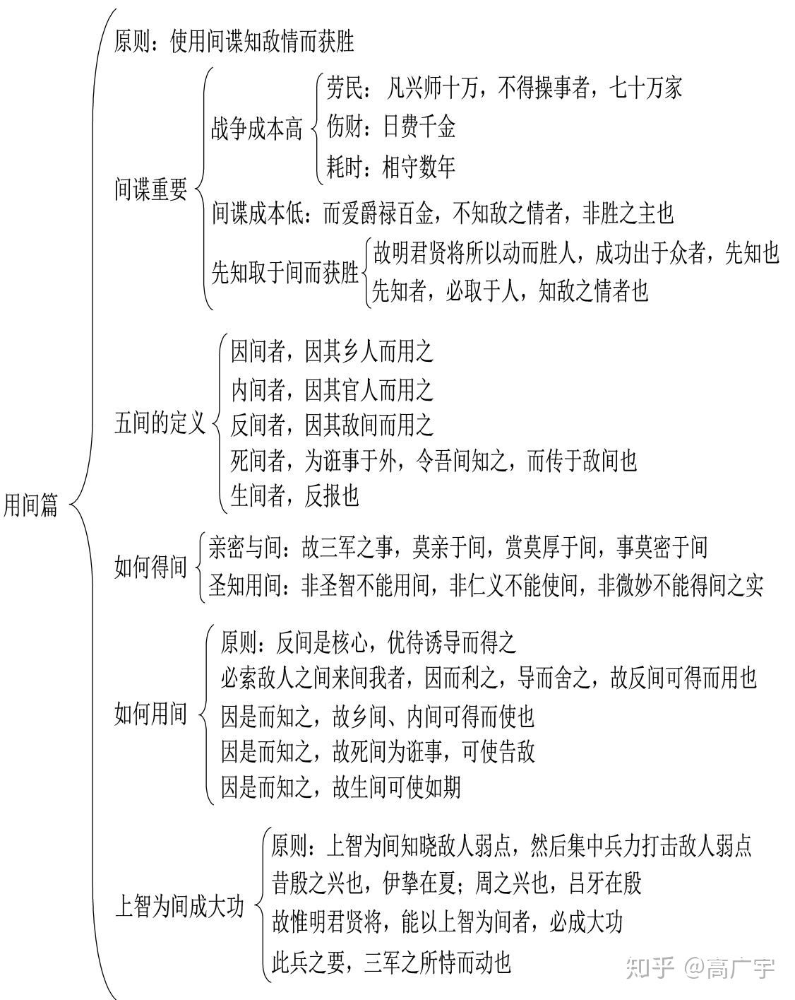

# 孙子兵法

### 用间第十三篇

本篇主要谈论离间计，间谍有五种：因间、内间、反间、死间、生间。

本章的逻辑：

1. 第一章为用间的重要性
2. 第二章为五类间谍的定义
3. 第三章为如何得到间谍和对待间谍
4. 如何使用间谍和反间的重要性
5. 上智为间成大功

【原文】

​		孙子曰：==凡兴师十万，出征千里，百姓之费，公家之奉，日费千金==；内外骚动，怠于道路，不得操事者，七十万家；相守数年，以争一日之胜。而爱爵禄百金，不知敌之情者，不仁之至也，非民之将也，非主之佐也，非胜之主也。故明君贤将，所以动而胜人，成功出于众者，先知也。先知者，不可取于鬼神，不可象于事，不可验于度，必取于人，知敌之情者也。
​		故用间有五：==有因间，有内间，有反间，有死间，有生间。==五间俱起，莫知其道，是谓“神纪”，人君之宝也。因间者，因其乡人而用之。内间者，因其官人而用之。反间者，因其敌间而用之。死间者，为诳事于外，令吾闻知之，而传于敌间也。生间者，反报也。
​		故三军之事，莫亲于间，赏莫厚于间，事莫密于间；非圣贤不能用间，非仁义不能使间，非微妙不能得间之实。微哉微哉！无所不用间也。间事未发，而先闻者，间与所告者兼死。凡军之所欲击，心城之所欲攻，人之所欲杀，必先知其守将、左右、谒者、门者、舍人之姓名，令吾间必索知之。
​		必索敌人之间来间我者，因而利之，导而舍之，故反间可得而用也。因是而知之，故乡间、内间可得而使也。因是而知之，故死间为诳事，可使告敌。因是而知之，故生间可使如期。五间之事，主必知之，知之必在于反间，故反间不可不厚也。
​		昔殷之兴也，伊挚在夏，周之兴也，吕牙在殷。故惟明君贤将，能以上智为间者，必成大功。此兵之要，三军之所悖而动也。

【通译】

​		孙子说：凡兴兵10万，千里征战，百姓的耗费，国家的开支，每天要花费千金，全国上下动荡不安，民众服徭役，疲惫于道路，不能从事耕作的有70万家。[战争](http://www.guoxuemeng.com/gushici/zhanzhengshi/)双方相持数年，是为了胜于一旦，如果吝啬爵禄和金钱不重用间谍，以致不能了解敌人情况而遭受失败，那就太“不仁”了。这样的将帅，不是军队的好将帅，不是国君的好助手;这样的国君，不是能打胜仗的好国君。英明的国君，良好的将帅，之所以一出兵就能战胜敌人，成功地超出众人之上的，其重要原因，在于他事先了解敌情。而要事先了解敌情，不可用迷信鬼神和占卜等方法去取得，不可用过去相似的事情作类比也不可用观察日月星辰运行位置去验证，一定要从了解敌情的人那里去获得。

​		使用间谍有五种：有因间，有内间，有反间，有死间，有生间。五种间谍同时都使用起来，便敌人莫测高深而无从应付，这是神妙的道理，是国君制胜敌人的法宝。所谓因间，是指利用敌国乡里的普通人做间谍。所谓内间，是指收买敌国的官吏做间谍。所谓反间，是指收买或利用敌方派来的间谍为我效力。所谓死间，是指故意散布虚假情况，让我方间谍知道而传给敌方，敌人上当后往往将其处死。所谓生间，是指派往敌方侦察后能活着回报敌情的。

​		所以军队人事中，没有比间谍再亲信的，奖赏没有比间谍更优厚的，事情没有比用间更机密的。不是才智过人的将帅不能使用间谍;不是仁慈慷慨的将帅也不能使用间谍;不是用心精细、手段巧妙的将帅不能取得间谍的真实情报。微妙啊!微妙啊!真是无处不可使用问谍呀!用间的计谋尚未施行，就被泄露出去，间谍和知道机密的人都要处死。

​		凡是要攻击的敌方军队，要攻的敌人城邑，要斩杀的敌方人员，必须预先了解那些守城将帅、左右亲信、掌管传达、通报的官员、负责守门的官吏以及门客幕僚的姓名，命令我方间谍一定要侦察清楚。

​		必须搜索出敌方派来侦察我方的间谍，以便依据情况进行重金收买、优礼款待，要经过诱导交给任务，然后放他回去，这样，反间就可以为我所用了。从反间那里得知敌人情况之后，所以乡间、内间就可得以使用了。因从反间那里得知敌人情况，所以散布给死间的虚假情况就可以传给敌人。因从反间那里得知敌人情况，所以生间就可遵照预定的期限，回来报告敌情。五种间谍使用之事，国君都必须懂得，其中的关键在于会用反间。所以，对反间不可不给予优厚的待遇。

​		从前商朝的兴起，是由于重用了在夏为臣的伊尹;周朝的兴起，是由于重用了在殷为官的姜子牙。所以，明智的国君、贤能的将帅，能用极有智谋的人做间谍，一定能成就大的功业。这是用兵作战的重要一着，整个军队都要依靠间谍提供情报而采取行动。

本文的结构图：

