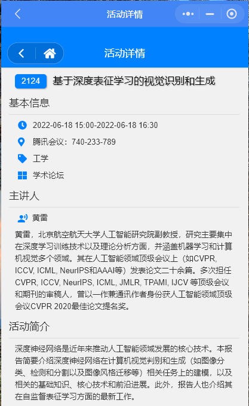
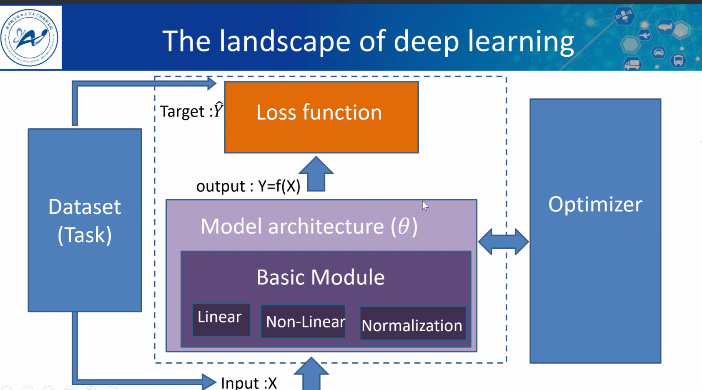
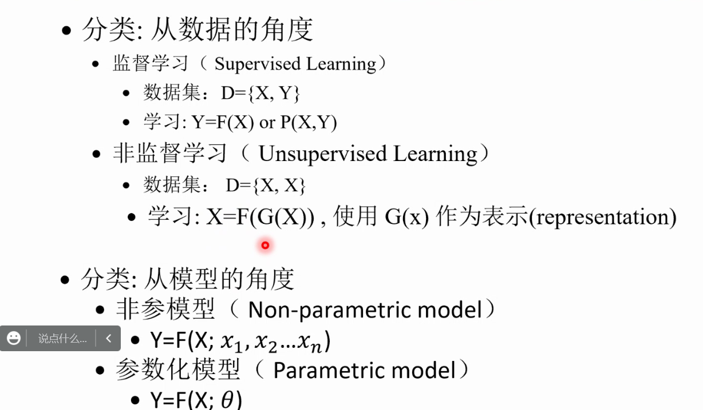
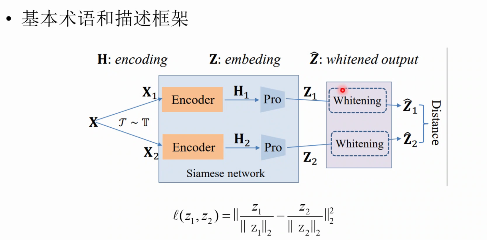

# 2022/6/18

## 基于深度表征学习的视觉识别和生成

#### 1. 人工智能应用：

产业应用：智能机器人，智能风控，智慧医疗，智能交通，人脸识别，智能安防，自动驾驶，城市大脑

共性技术：目标检测、目标识别、目标分割；知识推理、机器翻译、智能回答；图像生成、3D视觉；声学模型、语音增强、语音识别、语音分析。

#### 2. 深度学习架构

#### 4. 视觉领域

1. 数据集

   MNIST, CIRFA（32x32）, IMAGENET(类别1000)

2. 判别模型

3. 生成模型

   

4. Image Caption: 根据图像生成描述

#### 5. 机器学习：

- 数据集：D={X, Y}
  - 输入：X
  - 输出Y
  - 学习：Y=F(X) or P(Y|X)
- 目标
  - 发现数据中的规律
  - 推广到未见到的数据

#### 6. 深度神经网络

#### 7. 针对维度坍塌问题——自监督，对比学习大的Batch size问题？

提出了**==特征白化==**

##### 通道白化

##### 随机分组