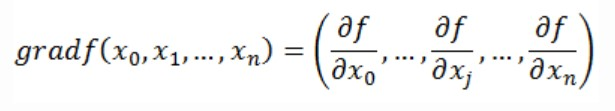

为什么要聊导数：

​	机器学习设计模型训练多数是优化问题， 常用的方法为 梯度下降，所以导数和梯度是常识和基础。

1. 导数的定义：

   

   

2. 导数的特点：

   反应函数$y=f(x)$在 某一点沿 $X$轴正方向的变化率。**函数f(x)在x轴上某一点处沿着x轴正方向的变化率/变化趋势。**

   

3. 导数和偏导数的区别：

   什么是偏导数：

   

   导数和偏导数的一致， 但是当自变量的变化量趋于0时， 函数值的变化量和自变量的变化量的比值的极限。

   

4. 区别：

   导数：一元函数中， 函数 $y=f(x)$在某一点 沿 X轴正方向的变化率

   偏导数：多元函数中，函数 $y=f(x_1, x_2, ..., x_n)$ 在 某一点， 沿着某一坐标轴 $(x_1, x_2, ..., x_n)$正方向的变化率。

5. 导数与方向导数：

   方向导数的定义：

   重点：==在导数和 偏导数 中， 均是沿着坐标轴正方向， 讨论函数的变化率==， **方向导数：某一点在某一趋近方向 上的导数值**。

   导数和偏导数： 坐标轴正方向

   方向导数：任意方向     

   

6. 导数和梯度关系：

   梯度的定义：**函数在某一点的梯度是这样一个向量，它的方向与取得最大方向导数的方向一致，而它的模为方向导数的最大值。**

   

   ==梯度回答的问题==：函数在变量空间的某一点，沿着 哪一个方向 有最大的变化率

   - 梯度是一个向量，有方向和大小
   - 梯度的方向是最大 方向导数的 方向
   - 梯度的值是最大 方向导数的值

   

7. 导数和向量：

   梯度 即 函数在某一点的最大的 方向导数 ， ==函数沿着梯度方向   有最大的变化率==
