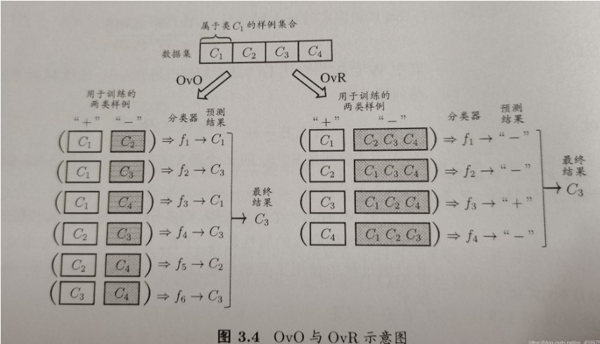
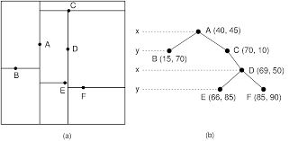

Kaggle机器学习基础：

### 1. Sklearn.emsemble 的随机森林的定义

[https://scikit-learn.org/stable/modules/generated/sklearn.ensemble.RandomForestClassifier.html](https://scikit-learn.org/stable/modules/generated/sklearn.ensemble.RandomForestClassifier.html)

随机森林分类器：

函数定义：

> *class* sklearn.ensemble.RandomForestClassifier(*n_estimators=100*, ***, *criterion='gini'*, *max_depth=None*, *min_samples_split=2*, *min_samples_leaf=1*, *min_weight_fraction_leaf=0.0*, *max_features='auto'*, *max_leaf_nodes=None*, *min_impurity_decrease=0.0*, *bootstrap=True*, *oob_score=False*, *n_jobs=None*, *random_state=None*, *verbose=0*, *warm_start=False*, *class_weight=None*, *ccp_alpha=0.0*, *max_samples=None*)
>
> 

A random forest is a meta estimator that fits a number of decision tree classifiers on various sub-samples of the dataset and uses averaging to improve the predictive accuracy and control over-fitting. The sub-sample size is controlled with the `max_samples` parameter if `bootstrap=True` (default), otherwise the whole dataset is used to build each tree.


参数详解：

- n_estimators=100：表示森林中的树木的数量，默认100
- max_depth: tree的深度
- min_sample_leaf: 叶子结点的最少的样本数量， 默认最少为1

代码实例：

> ```
> >>> from sklearn.ensemble import RandomForestClassifier
> >>> from sklearn.datasets import make_classification
> >>> X, y = make_classification(n_samples=1000, n_features=4,
> ...                            n_informative=2, n_redundant=0,
> ...                            random_state=0, shuffle=False)
> >>> clf = RandomForestClassifier(max_depth=2, random_state=0)
> >>> clf.fit(X, y)
> RandomForestClassifier(...)
> >>> print(clf.predict([[0, 0, 0, 0]]))
> ```


### 2. 支持向量机分类器（SVC）

from sklearn.svm import SVC, LinearSVC

函数定义：

> *class* sklearn.svm.SVC(***, *C=1.0*, *kernel='rbf'*, *degree=3*, *gamma='scale'*, *coef0=0.0*, *shrinking=True*, *probability=False*, *tol=0.001*, *cache_size=200*, *class_weight=None*, *verbose=False*, *max_iter=- 1*, *decision_function_shape='ovr'*, *break_ties=False*, *random_state=None*)[[source\]](https://github.com/scikit-learn/scikit-learn/blob/baf828ca1/sklearn/svm/_classes.py#L515)

函数解释：

The implementation is based on libsvm. The fit time scales at least quadratically with the number of samples and may be impractical beyond tens of thousands of samples. For large datasets consider using [`LinearSVC`](https://scikit-learn.org/stable/modules/generated/sklearn.svm.LinearSVC.html#sklearn.svm.LinearSVC) or [`SGDClassifier`](https://scikit-learn.org/stable/modules/generated/sklearn.linear_model.SGDClassifier.html#sklearn.linear_model.SGDClassifier) instead, possibly after a [`Nystroem`](https://scikit-learn.org/stable/modules/generated/sklearn.kernel_approximation.Nystroem.html#sklearn.kernel_approximation.Nystroem) transformer.

The multiclass support is handled according to a one-vs-one scheme.


参数详解：

- C: float ->正则化参数

- kernel: 核函数类型

- degree: 多项式核函数的阶数

- decision_function_shape:

  'ovo'->one vs. one：一对一分类， 形状为(n_samples,  n_classes* (n_classes-1)/2)， 最常用

  'ovr'->one vs. rest：一对多分类， 形状为(n_samples, n_classes)




### 3. GradientBoostingClassifier

函数定义：梯度提升分类

> *class* sklearn.ensemble.GradientBoostingClassifier(***, *loss='deviance'*, *learning_rate=0.1*, *n_estimators=100*, *subsample=1.0*, *criterion='friedman_mse'*, *min_samples_split=2*, *min_samples_leaf=1*, *min_weight_fraction_leaf=0.0*, *max_depth=3*, *min_impurity_decrease=0.0*, *init=None*, *random_state=None*, *max_features=None*, *verbose=0*, *max_leaf_nodes=None*, *warm_start=False*, *validation_fraction=0.1*, *n_iter_no_change=None*, *tol=0.0001*, *ccp_alpha=0.0*)[[source\]](https://github.com/scikit-learn/scikit-learn/blob/baf828ca1/sklearn/ensemble/_gb.py#L900)[¶](https://scikit-learn.org/stable/modules/generated/sklearn.ensemble.GradientBoostingClassifier.html?highlight=gradientboostingclassifier#sklearn.ensemble.GradientBoostingClassifier)

函数解释：

Gradient Boosting for classification.

GB builds an additive model in a forward stage-wise fashion; it allows for the optimization of arbitrary differentiable loss functions. In each stage `n_classes_` regression trees are fit on the negative gradient of the binomial or multinomial deviance loss function. Binary classification is a special case where only a single regression tree is induced.

函数参数解释：

- loss: 损失函数， 默认为deviance,  exponential

- learning_rate: 学习率

- n_estimators: boosting的阶段数量。梯度提升对过度拟合相当稳健，因此较大的数量通常会带来更好的性能。

  ==注意==：此处为执行的阶段数量， 而随机森林为 使用的	CART树的多少

### 4. KNeighborsClassifier——K近邻分类

sklearn.neighbors.KNeighborsClassifier

函数定义：

> *class* sklearn.neighbors.KNeighborsClassifier(*n_neighbors=5*, ***, *weights='uniform'*, *algorithm='auto'*, *leaf_size=30*, *p=2*, *metric='minkowski'*, *metric_params=None*, *n_jobs=None*)[[source\]](https://github.com/scikit-learn/scikit-learn/blob/baf828ca1/sklearn/neighbors/_classification.py#L22)

函数参数解释：

- n_neighbors=5: 分类的数量
- weights: 权重计算公式， uniform——在邻域内的每个点的权值相同； distance——和距离成反比
- algorithm： used to compute the nearest neignbors: [KDTree](https://scikit-learn.org/stable/modules/generated/sklearn.neighbors.KDTree.html#sklearn.neighbors.KDTree)

what is the KDTree?

KDTree is a  space-patitionaing data structure. The picture is as follow:



The SKlearn define the algo like this:

> *class* sklearn.neighbors.KDTree(*X*, *leaf_size=40*, *metric='minkowski'*, ***kwargs*)

params:

- X-> like of shape(n_shamples, n_features): the number of points in the data set, and the dimension of the parameter space

- leaf-size: number of points at which to switch to brute-force;==if you modify the leaf-size, the result would not be differetn, but the model speed would be influenced==;

  ***the tree scales == n_samples / leaf-size***

Example codes:

> ```python 
> >>> import numpy as np
> >>> from sklearn.neighbors import KDTree
> >>> rng = np.random.RandomState(0)
> >>> X = rng.random_sample((10, 3))  # 10 points in 3 dimensions
> >>> tree = KDTree(X, leaf_size=2)              
> >>> dist, ind = tree.query(X[:1], k=3)                
> >>> print(ind)  # indices of 3 closest neighbors
> [0 3 1]
> >>> print(dist)  # distances to 3 closest neighbors
> [ 0.          0.19662693  0.29473397]
> ```


### 5.  LogisticRegression——逻辑回归

sklearn.linear_model.LogisticRegression

> *class* sklearn.linear_model.LogisticRegression(*penalty='l2'*, ***, *dual=False*, *tol=0.0001*, *C=1.0*, *fit_intercept=True*, *intercept_scaling=1*, *class_weight=None*, *random_state=None*, *solver='lbfgs'*, *max_iter=100*, *multi_class='auto'*, *verbose=0*, *warm_start=False*, *n_jobs=None*, *l1_ratio=None*)[[source\]](https://github.com/scikit-learn/scikit-learn/blob/baf828ca1/sklearn/linear_model/_logistic.py#L1120)

 the explanation of the algo:

Logistic Regression (aka logit, MaxEnt) classifier.

In the multiclass case, the training algorithm uses the one-vs-rest (OvR) scheme if the ‘multi_class’ option is set to ‘ovr’, and uses the cross-entropy loss if the ‘multi_class’ option is set to ‘multinomial’. (Currently the ‘multinomial’ option is supported only by the ‘lbfgs’, ‘sag’, ‘saga’ and ‘newton-cg’ solvers.)

This class implements regularized logistic regression using the ‘liblinear’ library, ‘newton-cg’, ‘sag’, ‘saga’ and ‘lbfgs’ solvers. **Note that regularization is applied by default**. It can handle both dense and sparse input. Use C-ordered arrays or CSR matrices containing 64-bit floats for optimal performance; any other input format will be converted (and copied).

The ‘newton-cg’, ‘sag’, and ‘lbfgs’ solvers support only L2 regularization with primal formulation, or no regularization. The ‘liblinear’ solver supports both L1 and L2 regularization, with a dual formulation only for the L2 penalty. The Elastic-Net regularization is only supported by the ‘saga’ solver.

***Logistic 回归的本质是：假设数据服从这个分布，然后使用极大似然估计做参数的估计。***