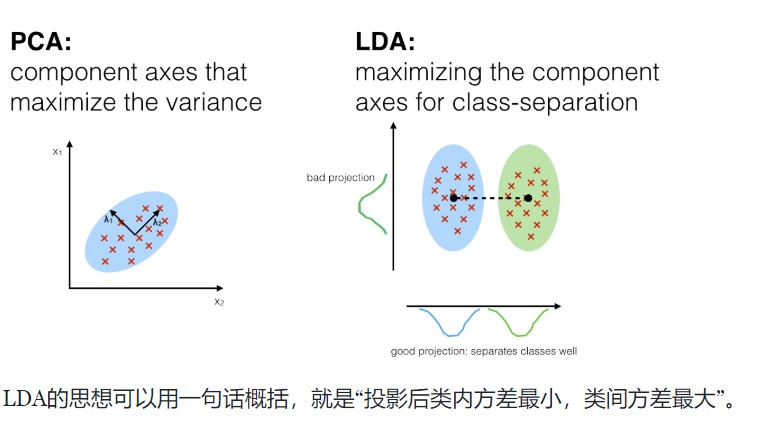
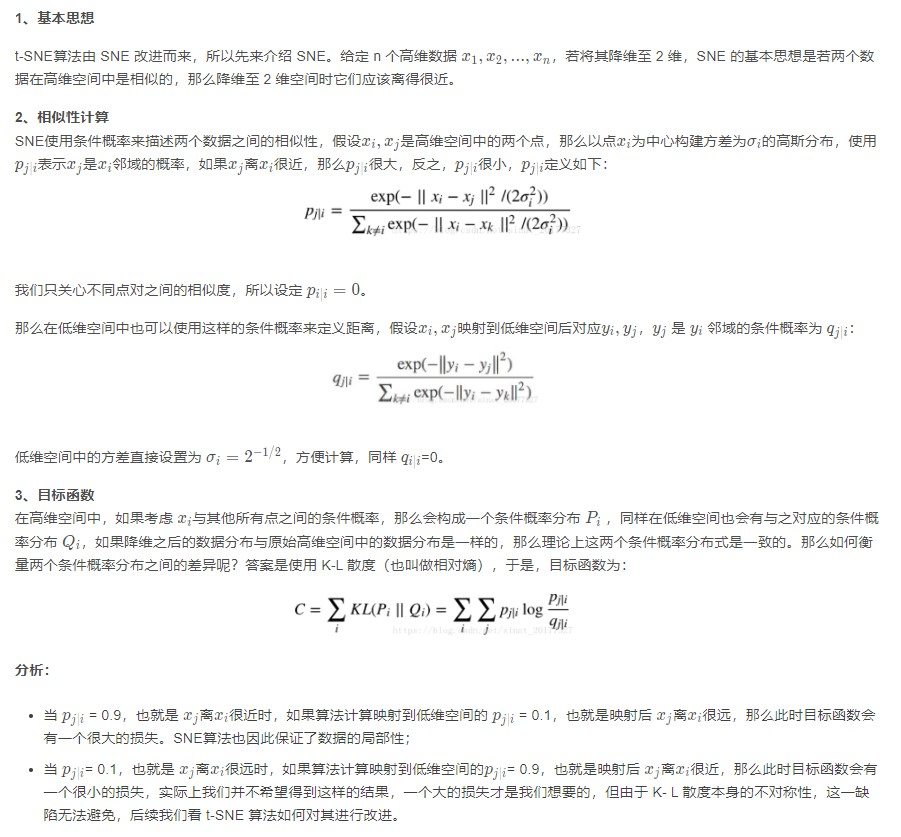

## 数据降维

Dimensionality-Reduction

The Main Idea include the 3 methods  as follows:

|             PCA             | LDA                       | t-SNE                           |
| :-------------------------: | ------------------------- | ------------------------------- |
| Unsupervised, linear method | Supervised, linear method | Nonlinear, probabilistic method |


### 1. PCA 主成分分析

- features: ==unsupervised, linear==

  simple use code example

  > ```python
  > import numpy as np # linear algebra
  > import pandas as pd # data processing, CSV file I/O (e.g. pd.read_csv)
  > 
  > import plotly.offline as py
  > py.init_notebook_mode(connected=True)
  > import plotly.graph_objs as go
  > import plotly.tools as tls
  > import seaborn as sns
  > import matplotlib.image as mpimg
  > import matplotlib.pyplot as plt
  > import matplotlib
  > %matplotlib inline
  > 
  > # Import the 3 dimensionality reduction methods
  > from sklearn.manifold import TSNE
  > from sklearn.decomposition import PCA
  > from sklearn.discriminant_analysis import LinearDiscriminantAnalysis as LDA
  > ```
  >
  > 

- get the engine  vector and engine values

  > ```python
  > from sklearn.preprocessing import StandardScaler
  > X=train.values()
  > x_std=StandardScaler().fit_tranform(X)
  > 
  > mean_vec=np.mean(x_std, axis=0)
  > cov_mat=np.conv(x_std.T)
  > eig_vals, eig_vec=np.linalg.eig(cov_mat)
  > ```
  >
  > 

- *How to use the PCA Function?*

  > ```python
  > n_components=30
  > pca=PCA(n_components=n_components).fit(train.values)
  > 
  > eigenvalues=pca.components_reshape(n_components, 28, 28)
  > eignevalues=pca.components
  > 
  > # after use the PCA , get the useful dimentions 
  > pca = PCA(n_components=5)
  > pca.fit(X_std)
  > X_5d = pca.transform(X_std)
  > ```
  >
  > 

- after the PCA algo,  reuse the KMeans method to classify the data set

  > ```python
  > from sklearn.cluster import KMeans # KMeans clustering 
  > # Set a KMeans clustering with 9 components ( 9 chosen sneakily ;) as hopefully we get back our 9 class labels)
  > kmeans = KMeans(n_clusters=9)
  > # Compute cluster centers and predict cluster indices
  > X_clustered = kmeans.fit_predict(X_5d)
  > 
  > ```


### 2. LDA——线性判别分析（linear discriminant analysis）

==**what's the difference between PCA and LDA?**==



> ```python
> lda=LDA(n_components=5)
> # Taking in as second argument the Target as labels
> X_LDA_2D = lda.fit_transform(X_std, Target.values )
> ```

**Attention:** **so the LDA method's core mind is exactly the ==fisher== **

### 3. T-SNE——T分布随机邻域嵌入

> ```python
> tsne=TSNE(n_components=2)
> tsne_results=tsne.fit_transform(X_std)
> ```

在实际应用中，t-SNE很少用于降维，主要用于[可视化](https://so.csdn.net/so/search?q=可视化&spm=1001.2101.3001.7020)

###### why  we do not use t-SNE???——计算复杂度很高，另外它的目标函数非凸，可能会得到局部最优解；

The core mind is the ==probs==:

