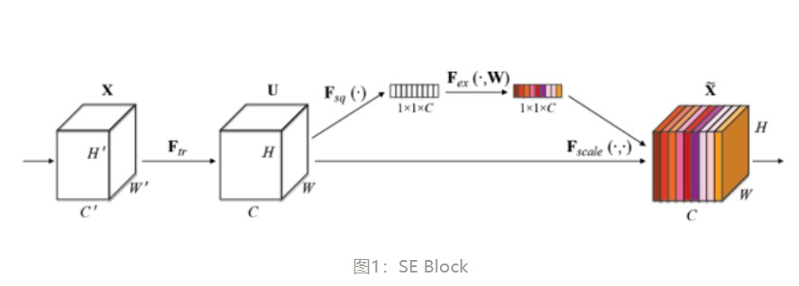
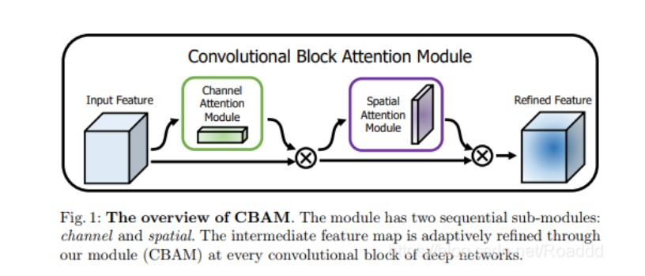
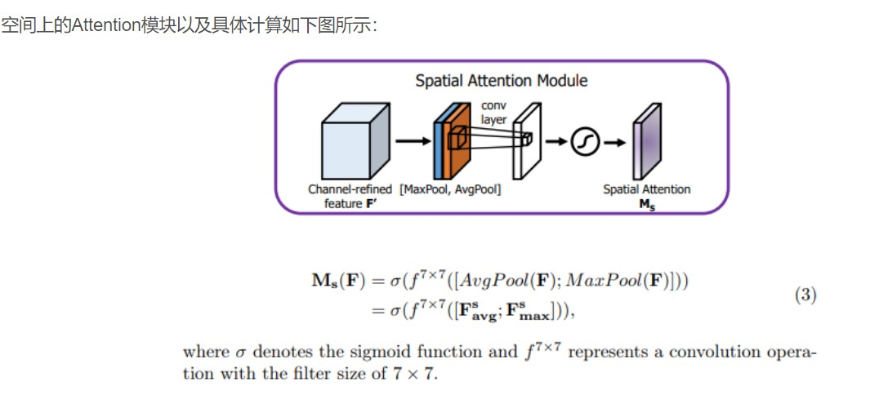
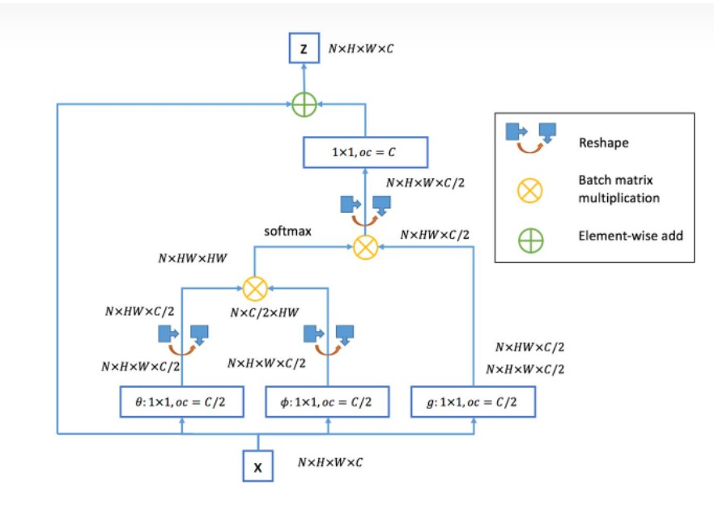
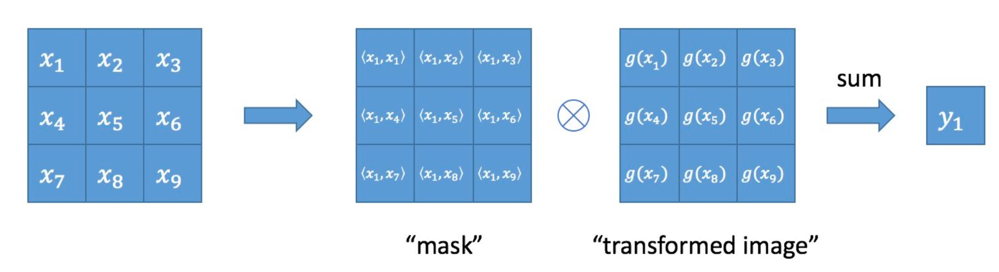

## 什么是注意力？？注意力有哪些？？


**视觉注意力 是 ==人类视觉特有的大脑信号处理机制==。**

现有注意力总结： 自注意力， 通道注意力， 空间注意力


论文：

1. SENet: [https://arxiv.org/abs/1709.01507](https://arxiv.org/abs/1709.01507)
2. CBAM:[https://arxiv.org/abs/1807.06521](https://arxiv.org/abs/1807.06521)
3. Non-Local:[https://openaccess.thecvf.com/content_cvpr_2018/papers/Wang_Non-Local_Neural_Networks_CVPR_2018_paper.pdf](https://openaccess.thecvf.com/content_cvpr_2018/papers/Wang_Non-Local_Neural_Networks_CVPR_2018_paper.pdf)
4. Transformer: [https://arxiv.org/abs/1706.03762](https://arxiv.org/abs/1706.03762)


### 1. SENet——Squeeze-and-Excitation Networks

SENet是自动驾驶公司在2017年提出（Momenta）， 通过对特征通道间的 ==相关性== 进行建模。

实现原理：

- Squeeze阶段：对 $H\times W$的特征图进行 平均池化，获得 $1\times1\times C$的特征
- Excitation阶段：使用两个全连接层实现。 先对 $C$ 通道的特征， 压缩成 $ C/r$ 个通道， 降低计算量， 然后紧跟着 RELU激活；第二个全连接层在恢复会 $C$ 个通道， 后面使用 Sigmoid 激活 （r=16）trade_off。

```python
class SELayer(nn.Module):
    def __init__(self, channel, reduction=16):
        super(SELayer, self).__init__()
        self.avg_pool = nn.AdaptiveAvgPool2d(1)
        self.fc = nn.Sequential(
            nn.Linear(channel, channel // reduction, bias=False),
            nn.ReLU(inplace=True),
            nn.Linear(channel // reduction, channel, bias=False),
            nn.Sigmoid()
        )

    def forward(self, x):
        b, c, _, _ = x.size()
        y = self.avg_pool(x).view(b, c)
        y = self.fc(y).view(b, c, 1, 1)
        return x * y.expand_as(x)
```


### 2. CBAM——Convolutional Block Attention Module



CBAM包含两个阶段：

- 通道注意力
- 空间注意力

通道注意力：

​	经过MaxPool 和 AvgPool 对 $H \times W\times C$ 的特征， 获得 $1\times 1\times C$ 的特征图 ， 然后将 其 送入 两层的神经网络（MLP）， 第一层的神经元个数为 $C/r$ ， 激活函数为Relu， 第二层为C——雷同 SEnet。

==区别==：使用了两种池化方式

空间注意力；



​	输入为通道注意力之后的结果，使用 Chnannel Attention对 特征图 F做 element-wise的乘法。然后针对 ==通道== C维度 做 global max pooling和global avg pooling ，得到两个 $H \times W\times 1$ 的特征图， 然后对这两个特征图 基于 Channel 做Concat操作，得到 $H \times W\times 2$ 的特征图， 然后使用 $7\times 7$ 的卷积核， 之后降维为 $H \times W \times 1$ ， 经过激活函数Sigmoid， 得到M_s， ==最后将Feature和输出的Feature做乘法， 得到最终的特征图==。


### 3. Non-local neural networks



Local:：针对 感受野（receptive field）来说， 以卷积核为例， 他的感受野为 卷积核的大小。

Non-local运算：
$$
y_i=\frac{1}{C(x)}\sum_{\forall j}f(x_i, x_j)g(x_j)
$$
对于感受野范围内的元素， 计算任意两个 $x_i, x_j$  的相关性。

操作示例图：

```python
import torch
from torch import nn
from torch.nn import functional as F


class _NonLocalBlockND(nn.Module):
    def __init__(self, in_channels, inter_channels=None, dimension=3, sub_sample=True, bn_layer=True):
        super(_NonLocalBlockND, self).__init__()

        assert dimension in [1, 2, 3]

        self.dimension = dimension
        self.sub_sample = sub_sample

        self.in_channels = in_channels
        self.inter_channels = inter_channels

        if self.inter_channels is None:
            self.inter_channels = in_channels // 2
            if self.inter_channels == 0:
                self.inter_channels = 1

        if dimension == 3:
            conv_nd = nn.Conv3d
            max_pool_layer = nn.MaxPool3d(kernel_size=(1, 2, 2))
            bn = nn.BatchNorm3d
        elif dimension == 2:
            conv_nd = nn.Conv2d
            max_pool_layer = nn.MaxPool2d(kernel_size=(2, 2))
            bn = nn.BatchNorm2d
        else:
            conv_nd = nn.Conv1d
            max_pool_layer = nn.MaxPool1d(kernel_size=(2))
            bn = nn.BatchNorm1d

        self.g = conv_nd(in_channels=self.in_channels, out_channels=self.inter_channels,
                         kernel_size=1, stride=1, padding=0)

        if bn_layer:
            self.W = nn.Sequential(
                conv_nd(in_channels=self.inter_channels, out_channels=self.in_channels,
                        kernel_size=1, stride=1, padding=0),
                bn(self.in_channels)
            )
            nn.init.constant_(self.W[1].weight, 0)
            nn.init.constant_(self.W[1].bias, 0)
        else:
            self.W = conv_nd(in_channels=self.inter_channels, out_channels=self.in_channels,
                             kernel_size=1, stride=1, padding=0)
            nn.init.constant_(self.W.weight, 0)
            nn.init.constant_(self.W.bias, 0)

        if sub_sample:
            self.g = nn.Sequential(self.g, max_pool_layer)
            self.phi = max_pool_layer

    def forward(self, x):
        '''
        :param x: (b, c, t, h, w)
        :return:
        '''

        batch_size = x.size(0)

        g_x = self.g(x).view(batch_size, self.inter_channels, -1)

        g_x = g_x.permute(0, 2, 1)

        theta_x = x.view(batch_size, self.in_channels, -1)
        theta_x = theta_x.permute(0, 2, 1)

        if self.sub_sample:
            phi_x = self.phi(x).view(batch_size, self.in_channels, -1)
        else:
            phi_x = x.view(batch_size, self.in_channels, -1)

        f = torch.matmul(theta_x, phi_x)
        f_div_C = F.softmax(f, dim=-1)

        y = torch.matmul(f_div_C, g_x)
        y = y.permute(0, 2, 1).contiguous()
        y = y.view(batch_size, self.inter_channels, *x.size()[2:])
        W_y = self.W(y)
        z = W_y + x

        return z


class NONLocalBlock1D(_NonLocalBlockND):
    def __init__(self, in_channels, inter_channels=None, sub_sample=True, bn_layer=True):
        super(NONLocalBlock1D, self).__init__(in_channels,
                                              inter_channels=inter_channels,
                                              dimension=1, sub_sample=sub_sample,
                                              bn_layer=bn_layer)


class NONLocalBlock2D(_NonLocalBlockND):
    def __init__(self, in_channels, inter_channels=None, sub_sample=True, bn_layer=True):
        super(NONLocalBlock2D, self).__init__(in_channels,
                                              inter_channels=inter_channels,
                                              dimension=2, sub_sample=sub_sample,
                                              bn_layer=bn_layer)


class NONLocalBlock3D(_NonLocalBlockND):
    def __init__(self, in_channels, inter_channels=None, sub_sample=True, bn_layer=True):
        super(NONLocalBlock3D, self).__init__(in_channels,
                                              inter_channels=inter_channels,
                                              dimension=3, sub_sample=sub_sample,
                                              bn_layer=bn_layer)
```

