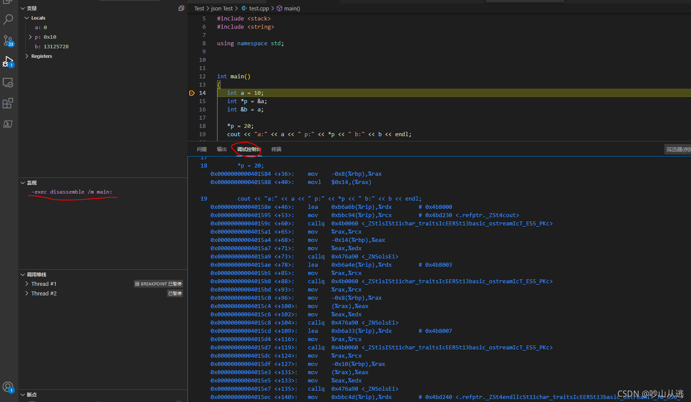

## C&C++笔记

#### 1. typedef, #define, ifdef之间的区别

1. typedef：经常用于为数据类型定义一个别名

   ```c
   typedef data_structure alias
   
   typedef long long int short_name 
   typedef struct Student a_student 
   ```

2. define：常用于定义一个符号常量

   ```c
   #define alias constant
   
   #define AGE 20 
   #define AGE "I am old" 
   #define AGE (270/10) 
   ```

3. ifdef：常用于条件编译

   

4. #if defined

   ```c
   #if defined (x) ...code... #endif
   ```

   

#### 2. 条件编译指令

- #if：条件为真，执行对应操作
- #elif：前面条件为假， 此条件为真
- #else
- #endif
- #ifdef：如果此宏定义，则执行之后的操作
- #ifndef：如果此宏没有定义，执行相应操作

- 常用搭配

  ```C
  #if-#else-#endif
  #ifndef-#define-#endif
  #if-#elif-#else-#endif
  #ifdef-#endif
  ```

#### 3. vscode反汇编C++代码

vscode打断点，然后在监视变量中输入  -exec disassemble /m 



具体参考链接：https://blog.csdn.net/y_universe/article/details/106052156